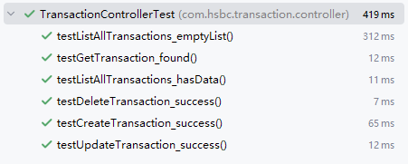

# hsbc-transaction-service

## 项目简介

本项目是一个基于Spring Boot构建的交易服务系统，提供交易记录的创建、修改、删除、分页查询等功能。采用Restful API设计原则，提供标准API接口，使用SpringDoc和Swagger进行接口文档的管理。系统采用标准的分层架构设计，包含 Controller、Service、DAO 层，并通过 VO、DTO 等对象实现数据封装与传输。
为了保证服务的高可用和稳定性，对系统进行了以下完善和扩展，支持缓存管理、统一异常处理、请求参数校验、日志输出等功能，同时进行了单元测试和压力测试，确保代码的质量和健壮性。


## 项目展示

- API访问地址：http://120.26.70.224:8090/swagger-ui/index.html
- 需要使用Postman或swagger-ui等工具进行接口访问


- 阿里云服务器2c2g配置，docker部署


## 技术栈

- **Java JDK 21**：编程语言
- **Spring Boot（v3.5.0）**：构建微服务基础框架
- **Spring MVC**：用于处理 HTTP 请求
- **Spring Chache + Caffeine**： 数据缓存存储
- **Lombok**：简化 Java Bean 编写
- **Log4j2**：日志输出管理
- **JUnit 5 + Mockito**：单元测试与集成测试支持
- **Swagger / SpringDoc**：API 文档生成
- **Maven(3.9.9) + Docker**：构建与部署


## 项目结构说明

```

src/
├── main/
│   ├── java/
│   │   └── com.hsbc.transaction/
│   │       ├── controller/      # 控制器层
│   │       ├── service/         # 服务层
│   │       ├── dao/             # 数据访问层
│   │       ├── entity/          # 数据库实体类
│   │       ├── vo/              # 响应数据对象
│   │       ├── dto/             # 请求数据传输对象
│   │       ├── model/           # 业务模型类
│   │       ├── common/          # 公共工具类或通用响应包装类
│   │       ├── config/          # 配置工具类
│   │       ├── enums/           # 枚举类
│   │       └── exception/       # 异常处理类
│   │
│   └── resources/
│       └── application.propertites      # 配置文件
│
└── test/
    └── java/
        └── com.hsbc.transaction/
            ├── controller/      # Controller 单元测试
            └── service/         # service 单元测试
```
## 功能模块

| 模块 | 功能说明                                               |
|------|----------------------------------------------------|
| **Controller** | 提供 RESTful API 接口，接收 HTTP 请求并返回响应                  |
| **Service** | 实现交易核心业务逻辑，包括增删改查及缓存操作，调用 DAO 层进行数据操作         |
| **DAO / Repository** | 数据访问层，与数据库交互，当前使用内存模拟数据库行为                         |
| **VO / DTO / Entity** | 数据模型定义，用于数据转换和传输（View Object, Data Transfer Object, Entity） |
| **Exception Handling** | 统一异常处理机制，包括自定义异常类和全局处理器                               |
| **Cache** | 使用 Spring Cache + Caffeine                                |
---

## 应用部署

### 1. 环境要求

- JDK 21
- Maven 3.5+
- docker（可选）

### 2. 构建与运行

本地环境运行如下：
```bash
# 克隆仓库
git clone https://github.com/zepingyu/hsbc-transaction-service.git

# 进入项目目录
cd hsbc-transaction-service

# 构建项目
mvn clean package

# 启动应用
java -jar target/hsbc-transaction-service.jar
```

Docker环境运行如下：
```bash
# 克隆仓库
git clone https://github.com/zepingyu/hsbc-transaction-service.git

# 进入项目目录
cd hsbc-transaction-service

# 构建项目
mvn clean package

# Build latest image
docker build -f docker/Dockerfile -t hsbc-transaction:latest .
container_name="transaction-service"

# Stop the previous version of the container (if any)
container_id=$(docker ps -aq -f name=${container_name}) 
if [ -n "$container_id" ]; then
  docker stop $container_id
  docker rm $container_id
fi

# Start the current version of the container
docker run -d -p 8090:8090 --name ${container_name} hsbc-transaction:latest

```

### 3. 访问接口文档

默认访问地址：
```
本地部署：http:127.0.0.1:8090/swagger-ui/index.html

docker部署：http://120.26.70.224:8090/swagger-ui/index.html
```

---


## 接口文档

以下是对本项目提供的 RESTful API 的详细说明，包括请求方法、URL、请求参数、请求体格式、响应格式和示例。

---

### 1. 创建交易记录
#### POST `/transaction/create`

**功能描述：**  
创建一个新的交易记录。

**请求头：**
```http
Content-Type: application/json
```


**请求体（JSON 格式）：**
```json
{
  "transactionInfo": {
    "amount": 100.0,
    "type": "withdraw",
    "description": "Sample transaction",
    "accountId": "ACC123456"
  }
}
```


**字段说明：**

| 字段名         | 类型     | 必填 | 描述      |
|-------------|--------|------|---------|
| amount      | double | 是 | 交易金额    |
| type        | String | 是 | 交易类型    |
| description | String | 否 | 交易描述    |
| accountId   | String | 是 | 关联账户 ID |


---

### 2. 修改交易记录
#### POST `/transaction/modify`

**功能描述：**  
修改已有交易记录的信息。

**请求头：**
```http
Content-Type: application/json
```


**请求体（JSON 格式）：**
```json
{
  "transactionInfo": {
    "transactionId": "T2025060001",
    "amount": 150.0,
    "description": "Updated transaction",
    "accountId": "ACC123456"
  }
}
```


**字段说明：**

| 字段名 | 类型 | 必填 | 描述 |
|--------|------|------|------|
| transactionId | String | 是 | 要修改的交易 ID |
| amount | double | 是 | 交易金额 |
| description | String | 否 | 交易描述 |
| accountId | String | 是 | 关联账户 ID |


---

### 3. 删除交易记录
#### POST `/transaction/delete`

**功能描述：**  
逻辑删除指定 ID 的交易记录（假删）。

**请求参数：**

| 参数名 | 类型 | 必填 | 描述 |
|--------|------|------|------|
| transactionId | String | 是 | 要删除的交易 ID |


---

### 4. 查询单个交易记录
#### POST `/transaction/getOne`

**功能描述：**  
根据交易 ID 查询交易详情，交易记录状态为有效或无效都可查询。

**请求参数：**

| 参数名 | 类型 | 必填 | 描述 |
|--------|------|------|------|
| transactionId | String | 是 | 要查询的交易 ID |


---

### 5. 分页查询所有有效交易记录
#### POST `/transactions/listAll`

**功能描述：**  
分页返回所有有效的交易记录。

**请求参数：**

| 参数名 | 类型 | 必填 | 默认值 | 描述 |
|--------|------|------|--------|------|
| pageNo | int | 否 | 0 | 页码（从 0 开始） |
| pageSize | int | 否 | 10 | 每页条数 |


### 响应结构说明

所有接口返回统一的 JSON 格式：

```json
{
  "code": 200,
  "message": "OK",
  "data": { /* 数据对象或列表 */ }
}
```

| 字段名 | 类型 | 描述 |
|--------|------|------|
| code | int | HTTP 状态码 |
| message | String | 状态描述信息 |
| data | Object / List | 返回的数据内容（可能为 null） |

---

### 示例请求与响应

#### 创建交易 - 请求
```bash
POST /transaction/create HTTP/1.1
Content-Type: application/json

{
  "transactionInfo": {
    "amount": 100.0,
    "type": "deposit",
    "description": "Initial deposit",
    "accountId": "ACC123456"
  }
}
```


#### 创建交易 - 响应
```json
{
  "code": 200,
  "message": "OK",
  "data": {
    "transactionId": "T2025060001",
    "amount": 100.0,
    "type": "deposit",
    "description": "Initial deposit",
    "status": "有效",
    "createTime": "2025-06-01 12:00:00",
    "updateTime": "2025-06-01 12:00:00"
  }
}
```


## 测试说明
### 单元测试

- 所有单元测试位于 `src/test/java` 目录下。
- 使用 `JUnit 5 + Mockito` 对 Service 和 Controller 层进行隔离测试。

- Contoller测试用例、测试覆盖率结果：




- Service测试用例、测试覆盖率结果：


## 压力测试
-  压测工具：Apifox
-  压测场景： 交易查询、交易变更（新增、编辑、删除功能）
-  参数：并发50,100；预热1min；运行5min

#### 压测报告
1.交易查询场景：单条以及分页查询交易数据
- 并发50,100；预热1min；运行5min


2.交易变更场景：模拟用户操作，新增交易、编辑交易、删除交易
- 并发50,100；预热1min；运行5min


## 后续工作 & 待优化点

1. 开发前端页面，实现交易的增、删、改、查。
2. 数据存储：可以借助MySQL进行数据持久化，并使用数据库级分页。
3. 高并发性能：可以借助Redis进行三级缓存，提升性能；使用Redis分布式锁，解决资源竞争问题；采用异步消息、限流等方式减轻服务压力。
4. 安全认证鉴权：把控接口、数据权限；增加oauth、sso或者token等验证机制。 
5. 完善异常处理机制：针对不同业务场景自定义异常类，统一处理异常。

